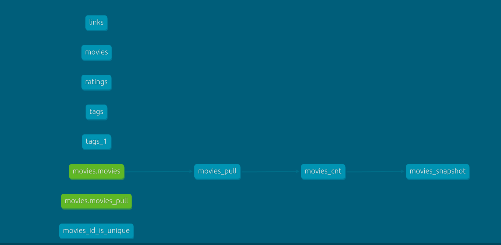

# dbt_demo
A simple demo project for dbt.

# requirement:
docker <br>
python

# how to run it
## prepare dtabase:
```bash
docker pull postgres

docker run \
    --name postgresql \
    -e POSTGRES_USER=myusername \
    -e POSTGRES_PASSWORD=mypassword \
    -p 5432:5432 \
    --network='host' \
    -d postgres

#by doing this you'll have a postgres container attach to the local machine
# user name: myusername, password: mypassword
# access point: 127.0.0.1:5432
# can use some tool like pgAdmin4 to connect to it

```

## prepare python env
```bash
pip install dbt-core
pip install dbt-postgres
pip install fal  #the library used to run py script in dbt

pip install pandas

#you can also use conda or python venv to do the virtual environment
```

## profile.yml
profile.yml including the connection config to postgres
for linux (Ubuntu), need to put profile.yml in ~/.dbt
```bash
mkdir .dbt
cp profile.yml ~/.dbt
```
or use need to specify the localtion of the profile as
```bash
dbt run --profiles-dir path/to/directory_of_profile
```

## run the program
```bash
cd jaffle_shop

dbt seed #this will update the csv file in seeds folder to speicfies schema: public_dbt
            # public is specified in profile.yml, dbt is specified in dbt_project.yml

fal flow run # this is dbt run + fal run
    #fal info https://github.com/fal-ai/fal, this library make dbt can run python script not just sql
    # a little pity is dbt docs don't consider the python script, so the DAG of the whole project is comprised a little. (still you can find a way to work this around)

dbt snapshot #by now this will check the "genre" column to get snapshot. 

dbt docs generate
dbt docs serve

```



